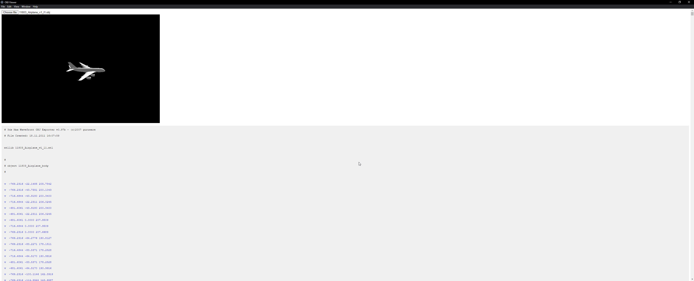

# OBJ Viewer

Just a small util for displaying a 3D Obj file, the contents of it and a small content editor.

# Setup

`npm init`

`npm install electron`

`npm install three`

`npm install three-obj-loader`

`npm run build`

`npm start`